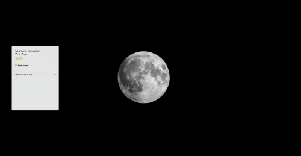

# Campaign Test Link Site
> Campaign 프로젝트 링크 테스트 사이트

- 프로젝트 배포 전 테스트 하는 시간을 줄이기 위해 사이트 구현
- 링크 테스트 때 URL을 매번 주별, 국가별로 편집해서 주는 일이 많아 번거로워 줄이고 싶었음.
- 퇴근하고 나서 테스트 하는 일이 발생할 때 가능(회사 내 서버가 아닌 외부 서버 주소 사용).

## 사용법
1. 아래 사이트로 접속 
> 사이트 주소: https://campaigntest.netlify.com/ 
2. 테스트 할 Week 선택
3. 테스트 할 국가 선택
4. 테스트 할 Section 선택  

## 편의기능
- Section 별로 바로 접속가능 (SPSS에서 필요한 데이터 삽입 되어있어서 해당 Section 바로 테스트 가능)
- 개발용 URL 주소를 버튼 하나로 주소 복사
- 모바일로도 접속 가능

## 기술
- Vue.js 2.6.10
- Vue Router
- Vuex
- vue-clipboards
- vue-select

## 개발 환경

- [Chrome](https://www.google.com/intl/ko/chrome/)
- [Git](https://git-scm.com/downloads)
- [Visual Studio Code](https://code.visualstudio.com/)
- [Node.js LTS 버전(v10.x 이상)](https://nodejs.org/ko/)
- [Vue.js Dev Tools](https://chrome.google.com/webstore/detail/vuejs-devtools/nhdogjmejiglipccpnnnanhbledajbpd)

## 사이트 주소
> https://campaigntest.netlify.com/ 
